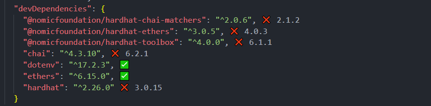

# Ethereum Transfer dApp

## Overview

A decentralized application (dApp) that enables users to send Ethereum transactions through a React.js web interface. The application connects to the Ethereum blockchain via MetaMask wallet and stores all transaction records permanently on-chain.

## Key Features

- Stunning blockchain-connected UI design
- Smart contract integration with MetaMask
- Send Ether through the Ethereum network
- Every transaction is accompanied by a GIF image and permanently stored on the blockchain
- View transaction history on Etherscan

## Environment Setup

Selecting stable and compatible packages is crucial for successful development. The following versions have been thoroughly tested and are recommended:

**Node.js:** v22.20.0

**Core Dependencies:**

- hardhat: ^2.26.0
- ethers.js: ^6.15.0

> **Note:** Hardhat v3 is not recommended due to compatibility issues. Ethers must be v6+ to work with Hardhat v2.

### Recommended Package Versions



### Installation Command

```bash
npm install --save-dev @nomicfoundation/hardhat-chai-matchers@2.0.6 @nomicfoundation/hardhat-ethers@3.0.5 @nomicfoundation/hardhat-toolbox@4.0.0 chai@4.3.10 dotenv@17.2.3 ethers@6.15.0 hardhat@2.26.0
```

## Project Structure

The project consists of two main parts:

### Frontend (`client/`)

Built with **Vite** instead of Create React App for superior development experience.

#### Why Vite?

| Feature            | Vite                            | CRA                     |
| ------------------ | ------------------------------- | ----------------------- |
| Startup Speed      | Milliseconds (ES modules)       | Seconds (full bundling) |
| HMR Performance    | Instant updates                 | Page refresh needed     |
| Configuration      | Simple & minimal                | Hidden complexity       |
| Build Optimization | Rollup-powered, smaller bundles | Standard webpack        |
| Flexibility        | Plugin-based extensibility      | Requires eject          |

**Resources:** [Vite Documentation](https://vite.dev/guide/)

#### Styling with Tailwind CSS

Tailwind CSS is a utility-first CSS framework that enables rapid UI development through predefined classes.

**Key Benefits:**

- **Speed**: Build styles directly in HTML without switching to CSS files
- **Consistency**: Predefined design tokens ensure unified styling
- **Responsive**: Built-in breakpoints (md:, lg:, etc.) for mobile-first design
- **Efficiency**: Only ships CSS classes actually used in production
- **Simplicity**: No custom class naming conventions needed

**Resources:** [Tailwind CSS with Vite](https://tailwindcss.com/docs/installation/using-vite)

### Smart Contracts (`contract/`)

To be implemented

## Getting Started

**Status:** In development
