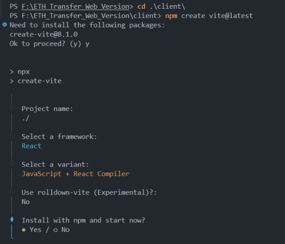
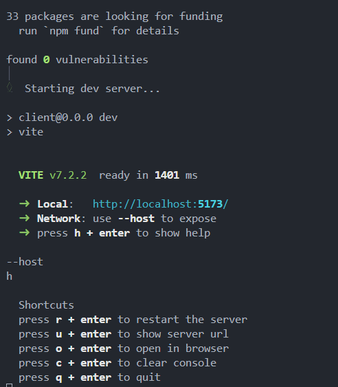
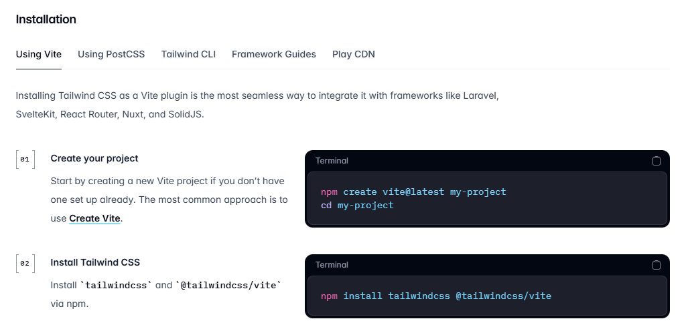
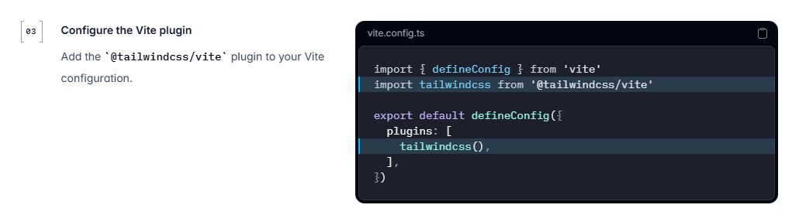
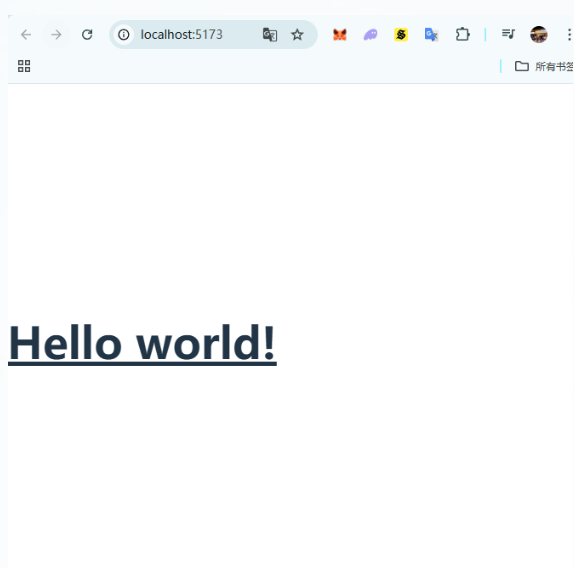

# Frontend Framework Setup Guide

## Overview

This guide walks through the setup of the React frontend for the ETH Transfer Web project using **Vite** and **Tailwind CSS**.

## Why Vite?

Vite offers significant advantages over Create React App (CRA):

- **Faster startup speed** - Near-instant server start
- **Faster HMR (Hot Module Replacement)** - Quick hot updates during development
- **Efficient bundling** - Better build optimization

## Step 1: Initialize Vite Project

Run the following command to scaffold a new Vite project:

```bash
npm create vite@latest
```



When prompted:

- **Project name**: `.` (use current directory)
- **Framework**: `React`
- **Variant**: `JavaScript + React Compiler`
- **Rollup**: `No`
- **Install**: `Yes` (to install and start now)

## Step 2: Verify Vite Project

After initialization, open `localhost:5173` in your browser to confirm the React app is running:




## Step 3: Install Tailwind CSS

Install Tailwind CSS and the Vite plugin:

```bash
npm install tailwindcss @tailwindcss/vite
```



## Step 4: Configure Vite Plugin

Update `vite.config.js` to include the Tailwind plugin:

```javascript
import { defineConfig } from "vite";
import tailwindcss from "@tailwindcss/vite";
import react from "@vitejs/plugin-react";

export default defineConfig({
  plugins: [tailwindcss(), react()],
});
```



## Step 5: Add Tailwind Imports

Add the Tailwind import to `src/index.css`:

```css
@import "tailwindcss";
```

## Step 6: Test the Setup

Run the development server:

```bash
npm run dev
```

Update `src/App.jsx` to test Tailwind styling:

```javascript
const App = () => {
  return (
    <>
      <h1 className="text-3xl font-bold underline">Hello world!</h1>
    </>
  );
};

export default App;
```

Add the stylesheet link to `index.html`:

```html
<link href="/src/style.css" rel="stylesheet" />
```

Visit `localhost:5173` to see the styled "Hello world!" page:


