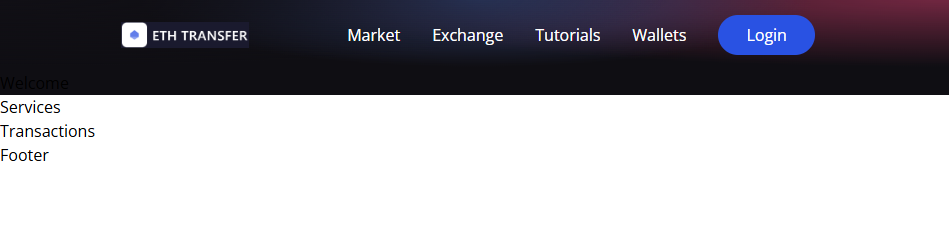

# Component Development Guide

**Author:** Peile Wu  
**Email:** peile.wu.1990@gmail.com  
**Date:** November 15, 2025

---

## Project Foundation

### Frontend Setup with Vite

The `client/` directory contains the React application. We use **Vite** (https://vite.dev/guide/) to initialize the React project instead of the traditional Create React App (CRA).

**Advantages of Vite over CRA:**

- Significantly faster startup speed
- Faster Hot Module Replacement (HMR)
- More efficient bundling process

**Installation:**

```bash
npm create vite@latest
```

When prompted, select React framework and JavaScript variant.

### Tailwind CSS Integration

The project uses **Tailwind CSS** (https://tailwindcss.com/) for styling, which integrates seamlessly with Vite.

**Installation:**

```bash
npm install tailwindcss @tailwindcss/vite
```

Configure the Vite plugin in `vite.config.js` and add the import in `src/index.css`:

```css
@import "tailwindcss";
```

---

## Part 1: Navbar Component

### Overview

The Navbar component serves as the primary navigation interface for the ETH Transfer React application, built with Vite and Tailwind CSS.

### File Organization

The project follows a modular structure with components located in `client/src/components/`:

```
components/
├── Navbar.jsx
├── Welcome.jsx
├── Services.jsx
├── Transactions.jsx
├── Footer.jsx
├── Loader.jsx
└── index.js
```

### Dependencies

Before implementing the Navbar, install required dependencies:

```bash
npm install react-icons ethers
```

### Development Process

The Navbar component features a responsive navigation bar with mobile-friendly hamburger menu functionality.

**Key Features:**

- Responsive design using Tailwind CSS breakpoints
- Logo display with brand identity
- Navigation menu items (Market, Exchange, Tutorials, Wallets)
- Call-to-action Login button
- Mobile toggle menu with smooth animations
- Icon integration using `react-icons` library

### Implementation Details

The component uses Tailwind's `lg` breakpoint for responsive behavior:

- **Large screens (lg and above):** Display full navigation menu
- **Small screens:** Hide menu, show hamburger icon for mobile users

The hamburger menu toggles on click to reveal navigation items in a side panel with glassmorphism styling. React hooks manage the menu state, and navigation items are dynamically mapped.

### Styling

The Navbar integrates with Tailwind CSS v4 and uses custom utility classes from `src/index.css`, including `.blue-glassmorphism` for the mobile menu panel styling.

### Navbar Component Display


