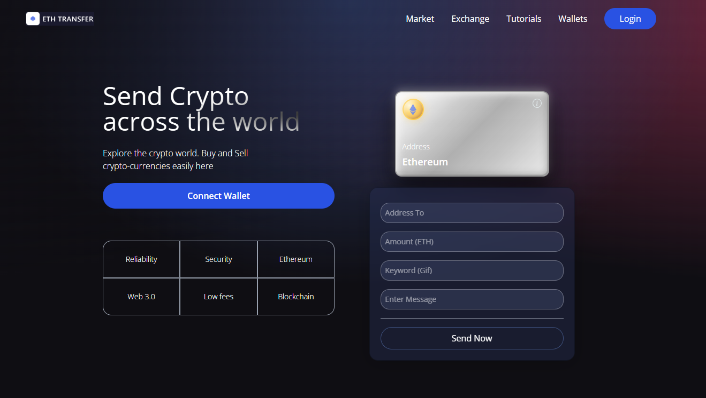

# Component Development Guide

**Author:** Peile Wu  
**Email:** peile.wu.1990@gmail.com  
**Date:** November 15, 2025

---

## Project Foundation

### Frontend Setup with Vite

The `client/` directory contains the React application. We use **Vite** (https://vite.dev/guide/) to initialize the React project instead of the traditional Create React App (CRA).

**Advantages of Vite over CRA:**

- Significantly faster startup speed
- Faster Hot Module Replacement (HMR)
- More efficient bundling process

**Installation:**

```bash
npm create vite@latest
```

When prompted, select React framework and JavaScript variant.

### Tailwind CSS Integration

The project uses **Tailwind CSS** (https://tailwindcss.com/) for styling, which integrates seamlessly with Vite.

**Installation:**

```bash
npm install tailwindcss @tailwindcss/vite
```

Configure the Vite plugin in `vite.config.js` and add the import in `src/index.css`:

```css
@import "tailwindcss";
```

---

## Part 1: Navbar Component

### Overview

The Navbar component serves as the primary navigation interface for the ETH Transfer React application, built with Vite and Tailwind CSS.

### File Organization

The project follows a modular structure with components located in `client/src/components/`:

```
components/
├── Navbar.jsx
├── Welcome.jsx
├── Services.jsx
├── Transactions.jsx
├── Footer.jsx
├── Loader.jsx
└── index.js
```

### Dependencies

Before implementing the Navbar, install required dependencies:

```bash
npm install react-icons ethers
```

### Development Process

The Navbar component features a responsive navigation bar with mobile-friendly hamburger menu functionality.

**Key Features:**

- Responsive design using Tailwind CSS breakpoints
- Logo display with brand identity
- Navigation menu items (Market, Exchange, Tutorials, Wallets)
- Call-to-action Login button
- Mobile toggle menu with smooth animations
- Icon integration using `react-icons` library

### Implementation Details

The component uses Tailwind's `lg` breakpoint for responsive behavior:

- **Large screens (lg and above):** Display full navigation menu
- **Small screens:** Hide menu, show hamburger icon for mobile users

The hamburger menu toggles on click to reveal navigation items in a side panel with glassmorphism styling. React hooks manage the menu state, and navigation items are dynamically mapped.

### Styling

The Navbar integrates with Tailwind CSS v4 and uses custom utility classes from `src/index.css`, including `.blue-glassmorphism` for the mobile menu panel styling.

### Navbar Component Display


---

## Part 2: Welcome Page Component

### Overview

The Welcome component is the hero section of the ETH Transfer application, showcasing the platform's main value proposition and providing users with an interactive interface to initiate cryptocurrency transfers.

### File Organization

The Welcome component is located at `client/src/components/Welcome.jsx` and utilizes custom CSS classes defined in `client/src/index.css`.

### Key Features

- **Hero Section:** Eye-catching headline with gradient text effect
- **Description Text:** Clear call-to-action messaging
- **Wallet Connection:** Button to connect cryptocurrency wallet
- **Feature Grid:** Six-cell grid highlighting platform benefits (Reliability, Security, Ethereum, Web 3.0, Low fees, Blockchain)
- **Interactive Card Display:** Silver metallic card showing Ethereum address information
- **Form Inputs:** Multiple input fields for transaction details:
  - Address To (recipient address)
  - Amount (ETH amount)
  - Keyword (GIF search)
  - Message (transaction message)
- **Action Button:** "Send Now" button to submit the transaction
- **Responsive Design:** Fully responsive layout for desktop and mobile devices

### Component Structure

The Welcome component is divided into two main sections:

**Left Section (Desktop: flex-1):**

- Main headline with gradient text
- Description paragraph
- Connect Wallet button
- Feature grid with 6 items

**Right Section (Desktop: flex-1):**

- Silver metallic card displaying Ethereum information
- Transaction form with multiple input fields
- Send Now button

### Input Component

A reusable `Input` component handles form field rendering:

```javascriptreact
const Input = ({ placeholder, name, type, value, handleChange }) => (
  <input
    placeholder={placeholder}
    type={type}
    step="0.0001"
    value={value}
    onChange={(e) => handleChange(e, name)}
    className="my-2 w-full rounded-sm p-2 outline-none bg-transparent text-white border-none text-sm white-glassmorphism"
  />
);
```

### Styling Implementation

The component utilizes multiple custom CSS classes and inline styles:

**Silver Card Styling (.silver-card):**

- Metal gradient background transitioning from light to dark gray
- Multi-layer shadow system for 3D depth effect:
  - Internal highlights for glossy appearance
  - Edge highlights for metallic edges
  - External shadows for elevation
  - Reflected light simulation
- Golden Ethereum icon with radial gradient effect
- Responsive height and width with Tailwind utilities

**Text Gradient (.text-gradient):**

- Radial gradient effect combining white highlights and black shadows
- Creates dynamic, dimensional text appearance
- Applied to main headline

**Form Container:**

- Uses `.blue-glassmorphism` class for semi-transparent blue background with backdrop blur
- Implements glassmorphism design pattern for modern aesthetic

### Interactive Elements

**Connect Wallet Button:**

- Tailwind styled with blue gradient background
- Hover state with darker shade for visual feedback
- Rounded pill shape for modern appearance

**Send Now Button:**

- Bordered design with `.white-glassmorphism` styling
- Full width layout within form container
- Text-white color for contrast

### Responsive Breakpoints

The component uses Tailwind's responsive utilities:

- **Mobile:** Single column layout, full-width elements
- **Tablet (md breakpoint):** 2-column layout with adjusted padding
- **Desktop:** Side-by-side layout with optimized spacing

### Welcome Page Component Display


