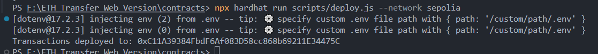

# Smart Contract Development Guide: Transactions Contract

**Author:** Peile Wu  
**Email:** peile.wu.1990@gmail.com  
**Date:** November 18, 2025

---

## Project Overview

This guide documents the development and deployment of the `Transactions` smart contract on the Sepolia testnet. The contract enables users to record and retrieve blockchain transactions with associated metadata, including messages and keywords for GIF retrieval functionality.

---

## Part 1: Smart Contract Design

### Contract Purpose

The `Transactions` contract serves as the core backend for the ETH Transfer application, allowing users to:

- Record cryptocurrency transfers with contextual information
- Store transaction metadata (sender, receiver, amount, message, timestamp, keyword)
- Query transaction history
- Retrieve transaction count

### Contract Architecture

#### State Variables

```solidity
uint256 transactionCount;
```

Tracks the total number of transactions recorded on the blockchain.

#### Data Structures

```solidity
struct TransferStruct {
    address sender;
    address receiver;
    uint amount;
    string message;
    uint256 timestamp;
    string keyword;
}
```

Defines the structure of each transaction, containing:

- **sender:** Address initiating the transfer
- **receiver:** Recipient address
- **amount:** ETH amount transferred
- **message:** Custom message attached to the transfer
- **timestamp:** Block timestamp of the transaction
- **keyword:** Search term for GIF integration

#### Storage

```solidity
TransferStruct[] transactions;
```

Dynamic array storing all recorded transactions.

#### Events

```solidity
event Transfer(address from, address receive, uint amount, string message, uint256 timestamp, string keyword);
```

Emitted when a transaction is recorded, enabling off-chain monitoring and indexing.

### Core Functions

#### addToBlockchain()

```solidity
function addToBlockchain(address payable receiver, uint amount, string memory message, string memory keyword) public
```

**Functionality:**

- Increments transaction counter
- Creates a new TransferStruct instance
- Pushes the transaction to the storage array
- Emits a Transfer event

**Parameters:**

- `receiver`: Recipient's wallet address
- `amount`: ETH amount to transfer
- `message`: Transaction message
- `keyword`: GIF search keyword

#### getAllTransactions()

```solidity
function getAllTransactions() public view returns (TransferStruct[] memory)
```

**Functionality:**

- Returns complete transaction history
- Read-only operation (no state modification)
- Useful for frontend to display all transactions

#### getTransactionCount()

```solidity
function getTransactionCount() public view returns (uint256)
```

**Functionality:**

- Returns the total number of transactions
- Lightweight query for transaction statistics

---

## Part 2: Development Environment Setup

### Prerequisites

Before deploying the contract, ensure the following tools and dependencies are configured:

#### 1. Install Core Dependencies

```bash
npm install --save-dev hardhat @nomiclabs/hardhat-ethers @nomiclabs/hardhat-waffle ethereum-waffle chai ethers dotenv
```

**Package Specifications:**

- `hardhat@^2.19.0` - Ethereum development environment
- `@nomiclabs/hardhat-ethers@^2.2.3` - Ethers.js integration
- `@nomiclabs/hardhat-waffle@^2.0.6` - Testing framework
- `ethereum-waffle@^4.0.10` - Smart contract testing utility
- `chai@^4.3.10` - Assertion library
- `ethers@^5.8.0` - Ethereum library
- `dotenv@^17.2.3` - Environment variable management

#### 2. Configure Environment Variables

Create a `.env` file in the `contracts/` directory:

```
ALCHEMY_API=https://eth-sepolia.g.alchemy.com/v2/YOUR_ALCHEMY_KEY
ACCOUNT=your_private_key_without_0x_prefix
```

**Security Note:** Never commit `.env` to version control. Add to `.gitignore`:

```
.env
.env.local
```

#### 3. Hardhat Configuration

The `hardhat.config.js` file orchestrates the development environment:

```javascript
require("dotenv").config();
require("@nomiclabs/hardhat-waffle");
require("@nomiclabs/hardhat-ethers");

const ALCHEMY_API = process.env.ALCHEMY_API || "";
const ACCOUNT = process.env.ACCOUNT || "";

module.exports = {
  solidity: "0.8.19",
  networks: {
    sepolia: {
      url: ALCHEMY_API,
      accounts: [ACCOUNT],
    },
  },
};
```

**Configuration Details:**

- **solidity version:** 0.8.19 (matching contract pragma)
- **Sepolia network:** Test network for safe deployment
- **Alchemy RPC:** Provides blockchain node access

---

## Part 3: Deployment Process

### Deployment Script

The `scripts/deploy.js` orchestrates contract deployment:

```javascript
const hre = require("hardhat");

const main = async () => {
  const Transactions = await hre.ethers.getContractFactory("Transactions");
  const transactions = await Transactions.deploy();
  await transactions.deployed();

  console.log("Transactions deployed to:", transactions.address);
};

const runMain = async () => {
  try {
    await main();
    process.exit(0);
  } catch (error) {
    console.error(error);
    process.exit(1);
  }
};

runMain();
```

### Deployment Steps

#### Step 1: Obtain Sepolia Test ETH

Fund your wallet with Sepolia testnet ETH using a faucet:

- **GHOST Faucet:** https://www.ghostchain.io/
- **QuickNode Faucet:** https://faucet.quicknode.com/ethereum/sepolia

Sepolia transactions require gas fees, necessitating testnet ETH in your account.

#### Step 2: Execute Deployment

Run the deployment script targeting the Sepolia network:

```bash
npx hardhat run scripts/deploy.js --network sepolia
```

#### Step 3: Verify Successful Deployment

Upon successful execution, the console displays:

```
Transactions deployed to: 0xC11A39384FbdF6Af083D58cc86Bb69211344475C
```

The returned address is the deployed contract's address on Sepolia, enabling interaction through web3 providers.

### Deployment Verification

The deployed contract address can be verified on Sepolia Etherscan:

```
https://sepolia.etherscan.io/address/0xC11A39384FbdF6Af083D58cc86Bb69211344475C
```

---

### Private Key Configuration

Ensure private key format in `.env`:

- Remove `0x` prefix if present
- Verify key validity through MetaMask Account Details

### Module Not Found Errors

Reinstall dependencies:

```bash
rm -r node_modules package-lock.json
npm install
```

---

## Deployment Success

The contract has been successfully deployed to the Sepolia testnet. The deployment confirmation screenshot is available at:



---
